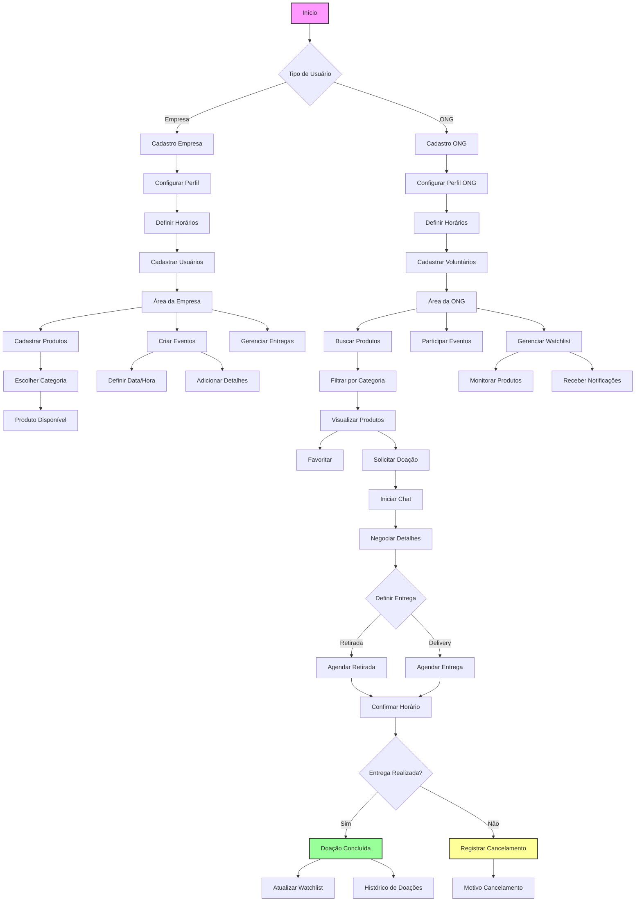
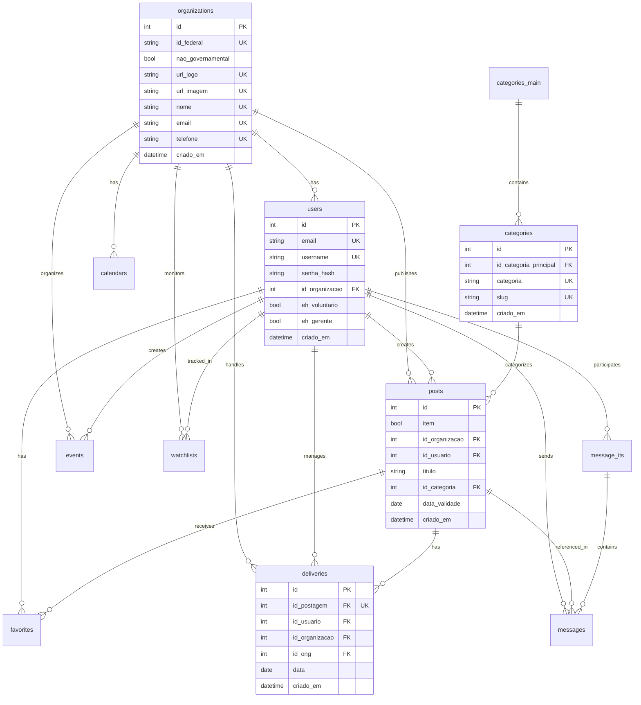
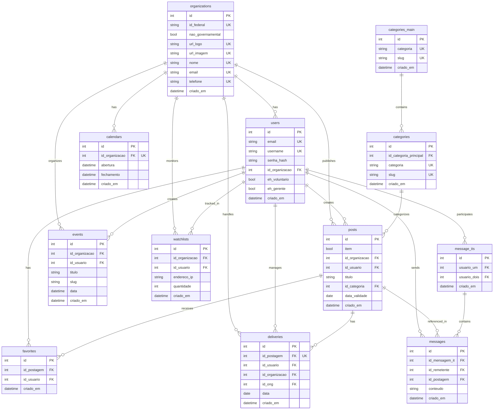

# Criar a imagem

```bash
    docker build -t "fast_rafa" .
```
# Verificar se a imagem foi criada

```bash
    docker images
```

# Rodar o container

```bash
    docker run -it --name fast_rafa -p 8000:8000 fast_rafa:latest
```
# Parar o container

```bash
    docker stop fast_rafa
```

# Usando docker-compose

```bash
    docker-compose up
```


# Diagrama de Caso de Uso



# Diagrama de Entidade-Relacionamento (ER) ( Esquema Resumido )




# Diagrama de Entidade-Relacionamento (ER) ( Esquema Completo )


