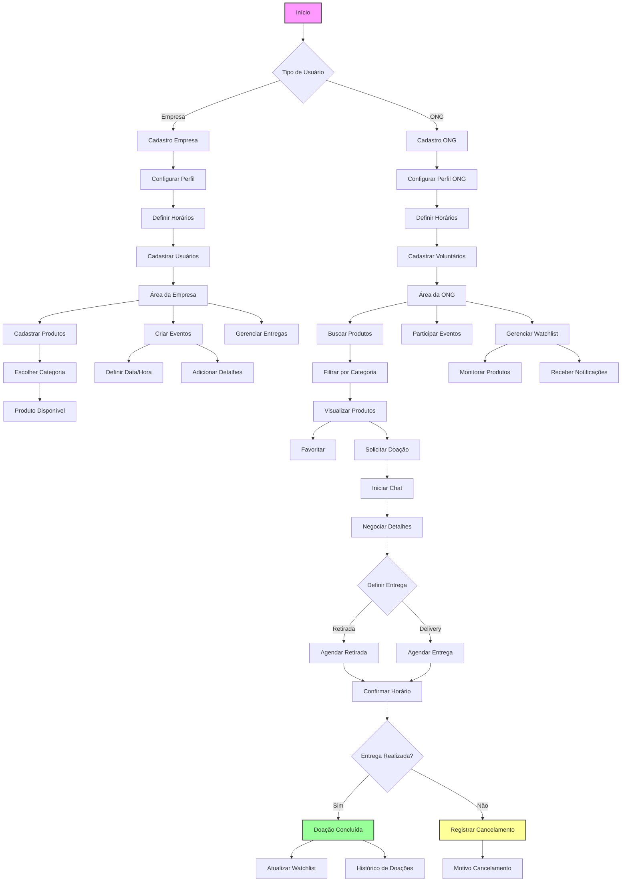
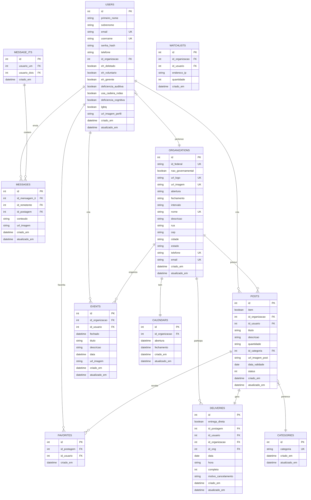

# Diagrama de Caso de Uso

```mermaid
    graph TD
    A[Início] --> B{Tipo de Usuário}
    B -->|Empresa| C[Cadastro Empresa]
    B -->|ONG| D[Cadastro ONG]

    %% Fluxo da Empresa
    C --> E[Configurar Perfil]
    E --> F[Definir Horários]
    F --> G[Cadastrar Usuários]

    G --> H[Área da Empresa]
    H --> I[Cadastrar Produtos]
    H --> J[Criar Eventos]
    H --> K[Gerenciar Entregas]

    I --> L[Escolher Categoria]
    L --> M[Produto Disponível]

    %% Fluxo da ONG
    D --> N[Configurar Perfil ONG]
    N --> O[Definir Horários]
    O --> P[Cadastrar Voluntários]

    P --> Q[Área da ONG]
    Q --> R[Buscar Produtos]
    Q --> S[Participar Eventos]
    Q --> T[Gerenciar Watchlist]

    %% Interação com Produtos
    R --> U[Filtrar por Categoria]
    U --> V[Visualizar Produtos]
    V --> W[Favoritar]
    V --> X[Solicitar Doação]

    %% Sistema de Chat
    X --> Y[Iniciar Chat]
    Y --> Z[Negociar Detalhes]

    %% Sistema de Entrega
    Z --> AA{Definir Entrega}
    AA -->|Retirada| AB[Agendar Retirada]
    AA -->|Delivery| AC[Agendar Entrega]

    %% Confirmação
    AB --> AD[Confirmar Horário]
    AC --> AD

    %% Finalização
    AD --> AE{Entrega Realizada?}
    AE -->|Sim| AF[Doação Concluída]
    AE -->|Não| AG[Registrar Cancelamento]
    AG --> AH[Motivo Cancelamento]

    %% Monitoramento
    AF --> AI[Atualizar Watchlist]
    AF --> AJ[Histórico de Doações]

    %% Subprocessos
    J --> AK[Definir Data/Hora]
    J --> AL[Adicionar Detalhes]

    T --> AM[Monitorar Produtos]
    T --> AN[Receber Notificações]

    style A fill:#f9f,stroke:#333,stroke-width:2px
    style AF fill:#9f9,stroke:#333,stroke-width:2px
    style AG fill:#ff9,stroke:#333,stroke-width:2px


```

# Diagrama de Entidade-Relacionamento (ER)

```mermaid
erDiagram
    USERS ||--o{ POSTS : "cria"
    USERS ||--o{ EVENTS : "cria"
    USERS ||--o{ FAVORITES : "favorita"
    USERS ||--o{ MESSAGES : "envia"
    USERS }|--|| ORGANIZATIONS : "pertence"
    USERS {
        int id PK
        string primeiro_nome
        string sobrenome
        string email UK
        string username UK
        string senha_hash
        string telefone
        int id_organizacao FK
        boolean eh_deletado
        boolean eh_voluntario
        boolean eh_gerente
        boolean deficiencia_auditiva
        boolean usa_cadeira_rodas
        boolean deficiencia_cognitiva
        boolean lgbtq
        string url_imagem_perfil
        datetime criado_em
        datetime atualizado_em
    }

    ORGANIZATIONS ||--o{ POSTS : "possui"
    ORGANIZATIONS ||--o{ EVENTS : "organiza"
    ORGANIZATIONS ||--|| CALENDARS : "tem"
    ORGANIZATIONS ||--o{ DELIVERIES : "participa"
    ORGANIZATIONS {
        int id PK
        string id_federal UK
        boolean nao_governamental
        string url_logo UK
        string url_imagem UK
        string abertura
        string fechamento
        string intervalo
        string nome UK
        string descricao
        string rua
        string cep
        string cidade
        string estado
        string telefone UK
        string email UK
        datetime criado_em
        datetime atualizado_em
    }

    POSTS ||--o{ FAVORITES : "recebe"
    POSTS ||--|| DELIVERIES : "gera"
    POSTS }|--|| CATEGORIES : "pertence"
    POSTS {
        int id PK
        boolean item
        int id_organizacao FK
        int id_usuario FK
        string titulo
        string descricao
        string quantidade
        int id_categoria FK
        string url_imagem_post
        date data_validade
        int status
        datetime criado_em
        datetime atualizado_em
    }

    CATEGORIES {
        int id PK
        string categoria UK
        datetime criado_em
        datetime atualizado_em
    }

    EVENTS {
        int id PK
        int id_organizacao FK
        int id_usuario FK
        datetime fechado
        string titulo
        string descricao
        datetime data
        string url_imagem
        datetime criado_em
        datetime atualizado_em
    }

    CALENDARS {
        int id PK
        int id_organizacao FK
        datetime abertura
        datetime fechamento
        datetime criado_em
        datetime atualizado_em
    }

    MESSAGE_ITS ||--o{ MESSAGES : "contem"
    MESSAGE_ITS {
        int id PK
        int usuario_um FK
        int usuario_dois FK
        datetime criado_em
    }

    MESSAGES {
        int id PK
        int id_mensagem_it FK
        int id_remetente FK
        int id_postagem FK
        string conteudo
        string url_imagem
        datetime criado_em
        datetime atualizado_em
    }

    DELIVERIES {
        int id PK
        boolean entrega_direta
        int id_postagem FK
        int id_usuario FK
        int id_organizacao FK
        int id_ong FK
        date data
        string hora
        int completo
        string motivo_cancelamento
        datetime criado_em
        datetime atualizado_em
    }

    WATCHLISTS {
        int id PK
        int id_organizacao FK
        int id_usuario FK
        string endereco_ip
        int quantidade
        datetime criado_em
    }

    FAVORITES {
        int id PK
        int id_postagem FK
        int id_usuario FK
        datetime criado_em
    }
```
